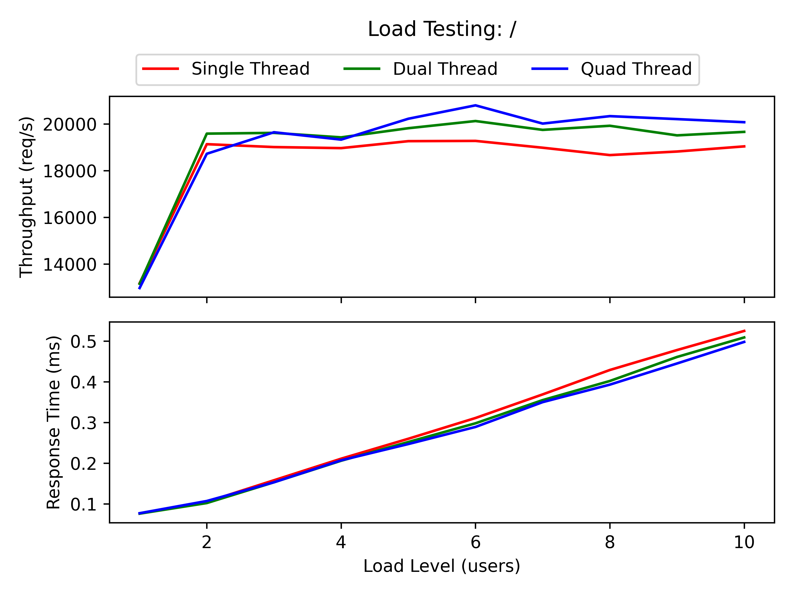

# cFlask

Super light weight Flask-like web framework for C.

## Dependencies

It depends on libHTTP, an open source HTTP library in C. Download the libHTTP version 1.8 from [here.](https://www.google.com/url?q=https://github.com/lammertb/libhttp/archive/v1.8.zip&sa=D&source=editors&ust=1673945574039344&usg=AOvVaw0E9xrE0wTCzGQKh1hYwEEc) Keep the libHTTP folder in the same directory as cFlask.

To perform load testing on the server, I have used the following tools:

- Apache Bench: To install Apache Bench, run the following command `sudo apt-get install apache2-utils`
- http-load-generator: Download the http-load-generator from [here.](https://github.com/rickydebojeet/http-load-generator)

## Usage

First compile the libHTTP library using the following commands:

```console
cd libHTTP
make build
make WITH_ALL=1
make install
cd ..
```

### Adding your own functions

To add your own functions, add the function in the `functions.c` file. The functions should be of the following format:

```c
/**
 * @request: The input provided by the user after ? in the url
 * @response: The response to be sent to the user
 */
void function_name(void *request, char *response)
{
    // Your code here
}
```

The function should handle all the errors like invalid input, etc. and send the appropriate response to the user.

The functions declaration should be added in the `functions.h` file. Moreover, the `FUNCTION_COUNT` should be updated in the `functions.h` file and shuold represent the number of functions in the `functions.c` file.

In the `functions.h` file there is a `url_list` array structure which contains the url, function address and the index to be mapped. Update the `url_list` array with the new function name and the url.

> Note: There are some sample functions in the `functions.c` file. You can use them as a reference.

### Running the server

To run the server, run the following command:

```console
make
./cflask <portno> <threads>
```

The `portno` is the port number on which the server will run and `threads` is the number of threads to be used by the server.

To check the server is running, open the browser and type `localhost:<portno>`

> Sample test url: `localhost:8080/square?num=10`

## Load Testing

I have used Apache Bench and http-load-generator to perform load testing on the server.

### Aim

The aim of the load testing is to check the performance of the server under different functions it is performing.

### Methodology

I have used the following setup for the load testing:

- Server: The server is running on a 4 core.
- Client: The client is running on a 8 core.

The server and the client are running on the same machine but on different cores.

I have varied the number of threads in the server and the number of concurrent users in the client and measured the throughput and the response time.

### Hypothesis

The throughput will increase with the increase in the number of threads in the server and the number of concurrent users in the client but will flatten out at some point. The response time will increase with the increase in the number of concurrent users.

Moreover, the throughput will decrease with increasing complexity of the function.

### Observations

#### Apache Bench

The following graph shows the throughput and the response time for the server with different number of threads and different number of concurrent users.



There is no drastic change in the throughput and the response time with the increase in the number of threads in the server. The throughput is almost ~20000 req/s after the concurrent user greater than one and the response time is increasing with the increase in the number of concurrent users.

We have seen same results with different functions. And there is no observed difference in the throughput and the response time for different functions.

#### http-load-generator

The following graphs shows the throughput and the response time for the server with different number of threads and different number of concurrent users.


### Conclusion

For the apahe bench, the throughput is almost ~20000 req/s after the concurrent user greater than one and the response time is increasing with the increase in the number of concurrent users. Where as the CPU utilization is never more than 50%. That means the server is not fully utilized and the client is not able to send the requests to the server at a faster rate.

But using the http-load-generator, we can see that the throughput is increasing with the increase in the number of concurrent users in the server and is flattening out at some point. The response time is also increasing with the increase in the number of concurrent users.

The throughput increases with the increase in the number of threads and the response time is also reduced.

The throughput is also less for the functions with more complexity and response time is higher.
